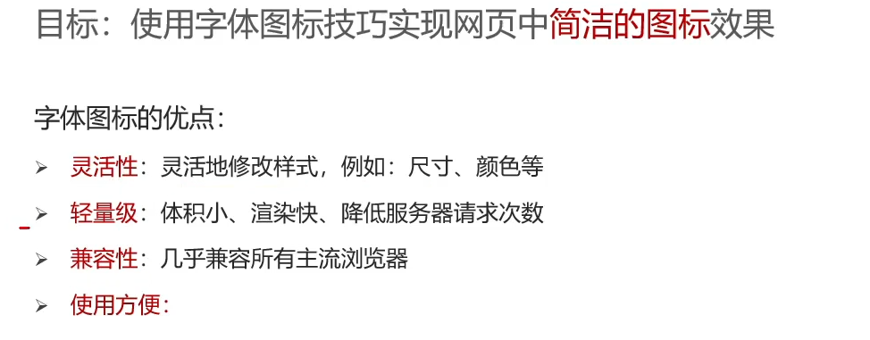

# 移动Web开发

## 字体图标



开源字体图标库：Iconfont: www.iconfont.cn


```html
<!DOCTYPE html>
<html lang="en">
<head>
    <meta charset="UTF-8">
    <meta http-equiv="X-UA-Compatible" content="IE=edge">
    <meta name="viewport" content="width=device-width, initial-scale=1.0">
    <title>购物车</title>
    <link rel="stylesheet" href="./font_icons/iconfont.css">
    <style>
        *{
            margin: 0;
            padding: 0;
        }

        li {
            list-style: none;
        }

        a{
            color: #333;
            text-decoration: none;
        }

        .nav{
            width: 200px;
            margin: 50px auto;
            font-size: 12px;
        }

        /* 橙色的类 */
        .orange{
            color: orange;
        }
    </style>
</head>
<body>
    <div class="nav">
        <ul>
            <li><a href="#">
                <span class="iconfont icon-user orange"></span>
                <span>购物车</span>
                <span class="iconfont icon-arrow-down-bold"></span>
            </a></li>
        </ul>
    </div>
</body>
</html>
```

## 平面转换


```html
<!DOCTYPE html>
<html lang="en">
<head>
    <meta charset="UTF-8">
    <meta http-equiv="X-UA-Compatible" content="IE=edge">
    <meta name="viewport" content="width=device-width, initial-scale=1.0">
    <title>Document</title>
    <style>
        .father{
            position: relative;
            width: 500px;
            height: 300px;
            margin: 100px auto;
            border: 1px solid #000;
        }

        .son{
            position: absolute;
            left: 50%;
            top: 50%;

            /* margin-left: -100px;
            margin-top: -50px; */
            transform: translate(-50%, -50%);
            width: 200px;
            height: 100px;
            background-color: pink;
            transition: all 0.5s;
        }

        /* 鼠标移入到父盒子 son 改变位置 */
        .father:hover .son{
            /* transform: translate(100px, 50px); */
            /* 百分比： 盒子自身尺寸的百分比 */
            transform: translate(100%, 50%);
        }
    </style>
</head>
<body>
    <div class="father">
        <div class="son"></div>
    </div>
</body>
</html>
```

### 双开门效果

```html
<!DOCTYPE html>
<html lang="en">

<head>
    <meta charset="UTF-8">
    <meta http-equiv="X-UA-Compatible" content="IE=edge">
    <meta name="viewport" content="width=device-width, initial-scale=1.0">
    <title>Document</title>
    <style>
        * {
            margin: 0;
            padding: 0;
        }
        
        .box {
            width: 1366px;
            height: 600px;
            margin: 0 auto;
            background: url('./images/bg.jpg');
            /* 超出这个盒子的宽度的元素都隐藏 */
            overflow: hidden;
        }
        
        .box::before,
        .box::after {
            float: left;
            content: '';
            width: 50%;
            height: 600px;
            background-image: url(./images/fm.jpg);
            transition: all .5s;
        }

        .box::after {
            background-position: right 0;
        }

        /* 鼠标移入的时候的位置改变的效果 */
        .box:hover::before {
            transform: translate(-100%);
        }

        .box:hover::after {
            transform: translateX(100%);
        }
    </style>
</head>

<body>
    <div class="box">

    </div>
</body>

</html>
```


[BootStrap 框架学习，响应式](移动Web开发/BootStrap 框架学习，响应式.md)